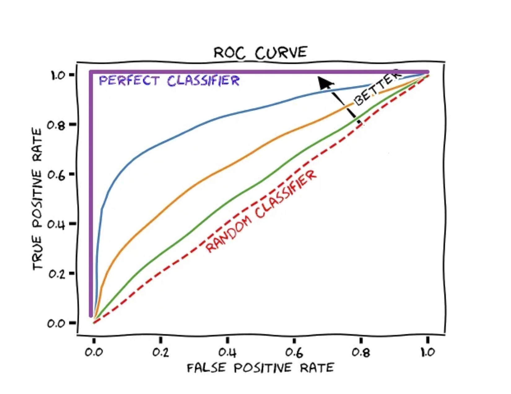

```{r setup, include=FALSE}
library(knitr)   # to help with the knitting process
knitr::opts_chunk$set(echo = TRUE)

library(tidyverse)
library(tidymodels)  # for modeling functions 
library(corrplot)
library(ggplot2)   # for most of our visualizations
library(ggthemes)
library(corrr)
library(dplyr)
library(plyr)
library(yardstick)  # metrics / metric set 
library(gridExtra)
library(naniar) # to assess missing data patterns
library(pROC)  # analyze ROC curves 
library(finalfit)
library(MASS)    # to assist with the markdown processes
library(dplyr)     # for basic r functions
library(discrim)  # discriminant analysis
library(klaR) # for naive Bayes
library(naniar)  # visualize missing data 
library(kableExtra)  
library(themis) # for upsampling
tidymodels_prefer()
options(scipen=999)  # remove scientific notation
```

# Introduction

This project tackles a binary classification problem: predict loan eligibility based on applicant demographics. I take a structured and analytical approach, leveraging multiple techniques to identify the best model for the problem. 

Data are pulled from [Kaggle](https://www.kaggle.com/datasets/vikasukani/loan-eligible-dataset) (originally sourced from an [Analytics Vidhya Hackathon](https://datahack.analyticsvidhya.com/contest/practice-problem-loan-prediction-iii/#ProblemStatement)).

## Problem Statement 
Loans are a necessity of the modern world, supporting financial stability and economic growth. Many types of loans exist for different purposes, among which are home loans, which we will tackle in this problem. 

Dream Housing Finance company deals in all types of home loans, with a presence across urban, semi-urban, and rural areas. The company seeks to automate their loan eligibility process using applicant data, such as gender, marital status, education, and income. 

The goal of this project is to identify customer segments most likely to be approved, leveraging these insights to optimize targeting. A partial dataset has been provided to support the development of this model. 

```{r echo=FALSE, out.width = "100%", fig.align = "center"}

```


## Data Sources 
The project uses 2 files:

* `train.csv`: 614 observations, 13 variables 
* `test.csv`: 367 observations, 12 variables (excluding the target) 

Note that only `train.csv` will be used in this project. A 70/30 split is performed internally to support supervised learning and model evaluation. 

## Project Roadmap 
The project will follow a structured workflow, starting with data processing and cleaning, followed by exploration, analysis, and modeling.

First, I load the dataset into R, assess its structure, and perform initial data tidying to address inconsistencies. Next, I conduct exploratory data analysis (EDA), extracting insights to guide further preprocessing. The dataset undergoes final tidying before modeling.

Then, I perform a 70/30 split on `train.csv`, build a preprocessing recipe, and create 10 validation sets for resampling. Models are trained and tuned in separate `.rda` files before being loaded back in for evaluation. The top 3 models are selected for testing and compared on ROC-AUC.

The project concludes with a detailed summary of key takeaways and findings. 

# Data Processing 

We start by loading in the data set and examining its structure to identify errors and inconsistencies. These insights will guide our initial tidying before further exploration. 

## Loading the Data
```{r, class.source = "fold-show", message=FALSE, warning=FALSE} 
loan_ds <- read.csv("project_data/train.csv")
str(loan_ds)
```

Notes: 

  * `Loan_ID`: a unique identifier for each applicant (primary key), is not relevant to our analysis.
  * `Credit_History`: a categorical variable, is encoded as binary (0 or 1). 
  * `ApplicantIncome` and `CoapplicantIncome` represent monthly incomes in dollars, while `LoanAmount` is given in terms of thousands. These features will be scaled for consistency before modeling. 
  
  
Next, we examine missingness in the dataset: 
  
```{r, class.source = "fold-show"}
colSums(is.na(loan_ds))  
```

We observe missing values in the following variables:

* `LoanAmount`: 22 missing
* `Loan_Amount_Term`: 14 missing
* `Credit_History`: 50 missing

Note: `is.na()` works on numeric data, but fails to detect blanks in categorical variables. Thus, we must use a different method to check for empty strings. 

```{r, class.source = "fold-show"}
sapply(loan_ds,function(x) table(as.character(x) =="")["TRUE"])
```
The output reveals that missingness in also present in `Gender`, `Married`, `Dependents`, and `Self-employed`. These blanks will be encoded as `NA` for easier handling. 


## Initial Tidying

Reload the dataset, reading in blank entries as `NA`.
```{r, class.source = "fold-show"}
loan_ds <- read.csv(file="project_data/train.csv",
                    header=TRUE,na.strings = c("", NA))   # read blanks as NA's 
```

Scale `ApplicantIncome` and `CoapplicantIncome` into thousands of dollars to match that of `LoanAmount`.  

```{r, class.source = "fold-show"}
loan_ds$ApplicantIncome <- (loan_ds$ApplicantIncome)/1000
loan_ds$CoapplicantIncome <- (loan_ds$CoapplicantIncome)/1000
```

Remove `Loan_ID`, a unique identifier, since it is not relevant to our analysis. 
```{r, class.source = "fold-show"}
loan_ds <- loan_ds[,-1]; colnames(loan_ds)
```

Encode categorical variables into factors: 

```{r, class.source = "fold-show"}
loan_ds$Gender <- factor(loan_ds$Gender, levels = c("Male","Female"))
loan_ds$Education <- factor(loan_ds$Education, levels = c("Graduate","Not Graduate"))
loan_ds$Self_Employed <- factor(loan_ds$Self_Employed, levels = c("Yes","No"))
loan_ds$Property_Area <- factor(loan_ds$Property_Area, levels = c("Rural","Semiurban","Urban"))
loan_ds$Loan_Status <- factor(loan_ds$Loan_Status, levels = c("Y","N"), labels = c("Yes","No")) 
loan_ds$Credit_History <- factor(loan_ds$Credit_History, levels = c(1,0), labels = c("Yes","No"))  
loan_ds$Dependents <- recode(loan_ds$Dependents,"3+"="3") %>%
  as.factor()
loan_ds$Married <- factor(loan_ds$Married)
```


## Missing Values

Now that we've cleaned up the dataset, we can examine missingness across all variables:
```{r, class.source = "fold-show"}
colSums(is.na(loan_ds))   # validate results
``` 

Visualize the distribution of missing data: 
```{r, class.source = "show"}
vis_miss(loan_ds) # visualize missing data
```

The table below provides a numerical summary of missingness in our data: It shows the # (`n_miss`) and percentage (`pct_miss`) of missing values for each variable, along with a cumulative sum (`n_miss_cumsum`) for the running total. 

```{r, class.source = "fold-show"}
missingness <- loan_ds %>%
  miss_var_summary(add_cumsum = TRUE) %>%
  dplyr::arrange(n_miss_cumsum) 

missingness
```

```{r, class.source = "fold-show"}
sum(missingness$pct_miss)  # total % of missingness in dataset 
```

There are 149 total missing values in our dataset, representing ~24% of the data. The variables `Credit_History` and `Self_Employed` exhibit the highest levels of missingness.

We have several options: 

  * Remove all records with missing values. 
  * Remove all variables with missingness above a certain threshold (%).
  * Impute missing values where appropriate. 

Methods 1 and 2 may lead to data loss, especially with large amounts of missing values in our data, so they are best avoided. The best route is typically imputation, with a variety of methods to choose from.

However, at this stage in our analysis, none of these options are appropriate since we have not yet explored which features are significant. Thus, we will leave the dataset as is and revisit in later steps. 


## Variable Description

Below is our final variable description, with the correct units and encoding:

* `Loan_ID` : Unique Loan ID.
* `Gender` : Male / Female. 
* `Married` : Whether the applicant is married (Yes / No). 
* `Dependents` : Number of dependents (0,1,2,3+), encoded as a factor. 
* `Education` : Applicant's education level (Graduate / Not Graduate). 
* `Self_Employed` : Whether the applicant is self-employed (Yes / No). 
* `ApplicantIncome` : Applicant's monthly income (in thousands of dollars). 
* `CoapplicantIncome` : Coapplicant's monthly income (in thousands of dollars).
* `LoanAmount` : Loan amount requested by an applicant (in thousands of dollars). 
* `Loan_Amount_Term` : Term of the loan in months. 
* `Credit_History` : Whether the applicant's credit history meets the bank's requirements (Yes / No). 
* `Property_Area` : Applicant's area of residence (Urban / Semiurban / Rural). 
* `Loan_Status` : Whether the loan was approved or not (Yes / No).


# Exploratory Data Analysis

This section focuses on EDA, using statistical analysis and data visualization techniques assess trends and variability. Insights derived from this step will inform further pre-processing. 

First, we will examine the response and covariation before performing feature analysis to guide further pre-processing.

## Loan Status 

First, we visualize the response `Loan_Status` with a barplot and frequency table. Both suggest a class imbalance, with 69% of applicants approved and 31% rejected. 

This imbalance may affect model performance, so we will likely need to address it at a later stage.

```{r}
loan_ds %>% 
  ggplot(aes(x = Loan_Status)) +
  geom_bar() + 
  theme_grey()  # create barplot 
```

```{r}
loan_ds %>%
  select(Loan_Status) %>%
  table() %>%
  prop.table() 
```


## Correlation Analysis

Examining dependence among features is a crucial step as it provides insight into relationships, interactions, and helps flag potential issues such as multicollinearity.

The `corrplot()` function generates a graphical display of a correlation matrix. The main diagonal are variances, while the off-diagonals represent covariances. The color scale indicates the strength and direction of these relationships. Note that `corrplot()` only accepts numeric variables. 


```{r, echo=FALSE, messages=FALSE, warnings=FALSE}
loan_ds %>%
  select(where(is.numeric)) %>%  # generate heatmap of numeric variables 
  na.omit() %>%  
  cor() %>%
  corrplot()
```

The plot below illustrates the magnitude of correlation coefficients. 
```{r}
loan_ds %>%
  select(where(is.numeric)) %>%
  na.omit() %>%  
  cor() %>%
  corrplot(method="number")
```

We observe a moderate, positive correlation (0.57) between `LoanAmount` and `ApplicantIncome`. There is little correlation among other predictors, which is a good sign.

We will keep these findings in mind as we explore the dataset. 

## Feature Analysis
The next few sections will focus on analyzing individual and paired features, applying descriptive, visualization, and inferential techniques to assess relationships and causality. 

### Loan Amount

The histogram displays a positive skew for `LoanAmount`, with most values between 0-400 and a few high outliers pulling the mean up. This provides a good proxy for the average loan requested by an applicant. 

The paired box plots stratify `Loan_Amount` by `Loan_Status`, providing insight into dispersion and variability. While the average loan amounts are similar between both groups, we observe greater variability among rejected applicants. 

```{r}
require(gridExtra)

plot1 <- loan_ds %>%
  na.omit(LoanAmount) %>%
  ggplot(aes(x=LoanAmount)) + 
  geom_histogram(bins=40) +
  theme_grey()

plot2 <- loan_ds %>%
  na.omit(LoanAmount) %>%
  ggplot(aes(Loan_Status, LoanAmount)) + 
  geom_boxplot(na.rm=T) +
  geom_jitter(alpha = 0.1) +
  theme_grey()

grid.arrange(plot1, plot2, ncol=2)
```

We validate our observations with an ANOVA test below. A p-value of 0.367 suggests an insignificant difference between means.
```{r}
anova(aov(LoanAmount ~ Loan_Status, loan_ds))  # validate observations
``` 

Next, we examine the relationship between `LoanAmount` and `ApplicantIncome`. Recall that these variables are positively correlated (0.57). 

The scatterplot shows an approximately linear trend, indicating that applicants with higher income tend to request larger loans. When stratifying by `Loan_Status`, we observe similar approval rates across different loan amounts. 

```{r, echo=FALSE}
plot1 <- loan_ds %>%
  na.omit(LoanAmount) %>% 
  ggplot(aes(y=LoanAmount, x=ApplicantIncome)) +
  geom_point() 

plot2 <- loan_ds %>%
  na.omit(LoanAmount) %>% 
  ggplot(aes(y=LoanAmount, x=ApplicantIncome, fill=Loan_Status,color=Loan_Status)) +
  geom_point() +
  theme_grey()

grid.arrange(plot1, plot2, ncol=2)
```

From these observations, it remains unclear whether `ApplicantIncome` is predictive of `Loan_Status`. This brings us to our next section. 

### Applicant Income 

Applicant monthly incomes range from 0.15 to 81 thousand dollars, with the majority of values between 5-7 thousand. 
```{r}
summary(loan_ds$ApplicantIncome)
``` 

The histogram shows a positive skew: even after excluding high outliers (>50), we observe an imbalance across income ranges. Average incomes among approved and rejected applicants are about the same. 
```{r}
plot1 <- loan_ds %>%
  filter(ApplicantIncome < 50) %>%    # filter by < 50 thousand  
  ggplot(aes(x=ApplicantIncome)) + 
  geom_histogram(fill="bisque",color="white",alpha=0.7, bins=10) + 
  geom_density() +
  geom_rug() + 
  labs(x = "applicant income") +
  theme_minimal()

plot2 <- loan_ds %>%
  filter(ApplicantIncome < 50) %>%  
  ggplot(aes(y=ApplicantIncome,x=Loan_Status, color=Loan_Status))+
  geom_boxplot() +
  theme_grey()

grid.arrange(plot1, plot2, ncol=2)
```


Upon inspecting the 3 high outliers (`ApplicantIncome` > 50), we find that: 

  * 2 out of 3 applicants have 3 or more dependents, both of whom are self-employed. 
  * 2 out of 3 applicants were approved for a loan; both reside in an urban area and have good credit history.
  * 2 out of 3 applicants are male 
  * All 3 applicants have a graduate degree and no coapplicant. 

```{r}
loan_ds %>%
  filter(ApplicantIncome > 50)
```

These findings suggest that neither `ApplicantIncome` or `LoanAmount` are predictive of `Loan_Status` in the most extreme cases, given that the most affluent applicant requesting the smallest amount (3) was rejected. 

From the trends observed above, we'd expect the opposite: applicants with higher income and lower loan amount are more likely to be approved. 

This also suggests that `Property_Area` and `Credit_History` may be relevant factors independent of `ApplicantIncome`, given that the only rejected applicant resided in a rural area with poor credit history. 

It remains unclear whether `Education` or `Dependents` affect loan status.


Now, we take a closer look at approval rates across different income strata. 

The table below bins applicants into income brackets defined in 5,000 increments (right inclusive). We find that applicants in the 4th bracket have the highest approval rate of ~77%. 

```{r, echo=FALSE, message=FALSE, warning=FALSE}
loan_ds %>%
  filter(ApplicantIncome < 50) %>%  
  dplyr::mutate(bin = cut(ApplicantIncome, breaks=c(0, 5, 10, 15, 20, 25))) %>%
  group_by(bin, Loan_Status) %>% 
  dplyr:: summarise(n=n()) %>%
  dplyr::mutate(freq = prop.table(n))  
```

This suggests that higher income somewhat correlates with higher approval rates. However, it's important to note that the # of data points in each bin varies, which may inflate or deflate the approval rates.

### Coapplicant Income

We now turn to examine coapplicant incomes. Recall that a coapplicant income of 0 indicates no coapplicant.

A density plot of `CoapplicantIncome` by `Loan_Status` shows that coapplicant incomes are right-skewed across both groups, with a slightly higher average for approved applicants.

```{r, echo=FALSE}
loan_ds %>%
  filter(CoapplicantIncome < 30) %>%  # omit high outliers
  ggplot(aes(x=CoapplicantIncome)) + 
  geom_histogram(fill="bisque",color="white",alpha=0.7, bins=20) + 
  geom_density() +
  geom_rug() + 
  labs(x = "Coapplicant Income") + 
  facet_wrap(~Loan_Status)  +   
  theme_minimal() 
```

Trends are difficult to discern due to the presence of 0 `CoapplicantIncome` values and high outliers (`CoapplicantIncome` > 30). The box plot below omits both, providing better insight into central tendency. 

We observe that, of those with a coapplicant, approval rates are approximately equal. 
```{r}
loan_ds %>%
  filter((CoapplicantIncome != 0) & (CoapplicantIncome < 30)) %>%    # not 0 and < 30
  ggplot(aes(x=Loan_Status, y=CoapplicantIncome, color=Loan_Status)) + 
  geom_boxplot()
```

What is more important: the presence of a coapplicant, or their income amount?  

First, we create a frequency table: 273 out of 614 (~44%) applicants do not have a coapplicant. 

```{r, message=FALSE, warning=FALSE}
loan_ds %>%
  dplyr :: count(CoapplicantIncome == 0) 
```

Next, we create a binary variable `has_coapp` to indicate the presence of a coapplicant and a contingency table by `Loan_Status`. The table suggests that the presence of a coapplicant improves approval rates by ~6%. 

```{r, message=FALSE, warning=FALSE} 
loan_ds %>%
  dplyr:: mutate(has_coapp = if_else(CoapplicantIncome != 0,TRUE,FALSE)) %>%
  group_by(has_coapp, Loan_Status) %>% 
  dplyr:: summarise(n=n()) %>%
  dplyr::mutate(freq = prop.table(n))  
# on average, ~72% of applicants w/ a coapplicant were approved for a loan
# while only ~65% of applicants w/o a coapplicant were approved.
```

These observations suggest that the presence of a coapplicant is more predictive of `Loan_Status` than the value of their income. Thus, we should consider transforming `CoapplicantIncome` into a factor.


### Loan Amount Term

`Loan_Amount_Term` provides the loan term in months. We observe a positive skew, indicating that its mean (~342) falls below its median and mode. In these cases, the mode is more representative of center.
```{r}
loan_ds %>%
  na.omit(Loan_Amount_Term) %>%
  ggplot(aes(x=Loan_Amount_Term)) + 
  geom_bar() +
  theme_grey() # mfv 360 
```

The plot below shows that applicants with short-term loans are more likely to be approved, on average, than those with long-term loans. We do, however, observe a high approval rate for 360 months.

Note that the data is very imbalanced, with ~85% of loans having a term of 360, likely under representing applicants with alternative loan terms.
```{r}
loan_ds %>%
  na.omit(Loan_Amount_Term) %>%  
  ggplot(aes(x=Loan_Amount_Term, fill=Loan_Status)) + 
  geom_bar(position="fill")
```


### Dependents

`Dependents` is right-skewed, with most applicants having no dependents (0). Approval rates are similar across all groups, with the highest approval observed among applicants with 2 dependents. 

There is no clear pattern, indicating that `Dependents` may not be very correlated with `Loan_Status`.
```{r}
plot1<-loan_ds %>%
  na.omit(Dependents) %>%  # should be able to impute this later
  ggplot(aes(x=Dependents)) +
  geom_bar()  # most applicants have no dependents

# dependents vs. loan status
plot2<-loan_ds %>%
  na.omit(Dependents) %>%  
  ggplot(aes(x=Dependents, fill=Loan_Status)) + 
  geom_bar(position="fill")
# relatively similar likelihood of approval for each # of dependents

grid.arrange(plot1,plot2,ncol=2)
```

The plots below suggest that applicants **with** dependents, on average, request a larger loan amount. However, the actual number of dependents do not seem very significant. 
```{r, echo=FALSE}
loan_ds %>%
  na.omit(Dependents,LoanAmount) %>%  
  ggplot(aes(x=LoanAmount, y=Dependents, group=Dependents, fill=Dependents)) + 
  geom_boxplot()
```


### Gender

There are more male applicants than female applicants (81% vs 19%), indicating a class imbalance.

```{r, message=FALSE, warning=FALSE}
prop.table(table(loan_ds$Gender))  # more males than females 
```

The plot below shows that female applicants are less likely (~8% lower) to be approved for a loan than males, suggesting potential bias in lending. A 2-way contingency table also supports our hypothesis. 
 
```{r}
loan_ds %>%
  na.omit(Gender) %>%  # should be able to impute this later
  ggplot(aes(x=Gender, fill=Loan_Status)) + 
  geom_bar(position="fill")
```
```{r}
# 2-way contingency table 
loan_ds %>%
  na.omit(Gender) %>%
  group_by(Gender, Loan_Status) %>% 
  dplyr:: summarise(n=n()) %>%
  dplyr::mutate(freq = prop.table(n))  
```


### Married

Married applicants comprise the majority of our data (~60%), which is surprising since most applicants have no dependents. The variable is slightly imbalanced, though less so than others. 

```{r, message=FALSE, warning=FALSE}
prop.table(table(loan_ds$Married))
```

```{R}
loan_ds %>%
  na.omit(Married) %>%
  ggplot(aes(x=Married,fill=Loan_Status)) +
  geom_bar(position="fill")
```

Notably, married applicants are 10% more likely to be approved for a loan (73% vs. 62%), suggesting that marital status affects loan status.
```{r} 
# 2-way contingency table 
loan_ds %>%
  na.omit(Married) %>%
  group_by(Married, Loan_Status) %>% 
  dplyr:: summarise(n=n()) %>%
  dplyr::mutate(freq = prop.table(n))  
```


### Education
`Education` is factor indicating if an applicant is a graduate or not. The variable displays a severe imbalance, with graduates comprising ~80% of our data. 

```{r, message=FALSE, warning=FALSE}
prop.table(table(loan_ds$Education))
```

```{r}
loan_ds %>%
  na.omit(Education) %>%
  ggplot(aes(x=Education,fill=Loan_Status)) +
  geom_bar(position="fill")
```

The contingency table shows that graduates are ~8% more likely to be approved than non-graduates, suggesting that higher education is associated with a greater chance of approval.

```{r}
# 2-way contingency table 
loan_ds %>%
  na.omit(Education) %>%
  group_by(Education, Loan_Status) %>% 
  dplyr:: summarise(n=n()) %>%
  dplyr::mutate(freq = prop.table(n))  
```


### Self employed
`Self_Employed` is a factor indicating whether an applicant is self-employed. We again observe a class imbalance: only ~14% of applicants are self-employed.  

```{r,message=FALSE, warning=FALSE}
prop.table(table(loan_ds$Self_Employed))
```

```{r}
loan_ds %>%
  na.omit(Self_Employed) %>%
  ggplot(aes(x=Self_Employed,fill=Loan_Status)) +
  geom_bar(position="fill")
```

There is no significant difference in approval rates between self-employed and non self-employed applicants (~4%). 

```{r}
# 2-way contingency table 
loan_ds %>%
  na.omit(Self_Employed) %>%
  group_by(Self_Employed, Loan_Status) %>% 
  dplyr:: summarise(n=n()) %>%
  dplyr::mutate(freq = prop.table(n))  
```


### Credit History

`Credit_History` is a categorical variable indicating whether an applicant's credit meets the bank's standards. The majority of applicants (~85%) have a good credit history. 

```{r, message=FALSE, warning=FALSE}
prop.table(table(loan_ds$Credit_History))
```

```{r}
loan_ds %>%
  na.omit(Credit_History) %>%
  ggplot(aes(x=Credit_History,fill=Loan_Status)) +
  geom_bar(position="fill")
```

Credit history appears to be a key determinant of loan status: nearly ~80% of applicants with good credit were approved, compared to only 10% of those with poor credit.

However, it is important to consider potential selection bias, as applicants with good credit may be more inclined to apply for a loan in the first place. 
```{r}
# 2-way contingency table 
loan_ds %>%
  na.omit(Credit_History) %>%
  group_by(Credit_History, Loan_Status) %>% 
  dplyr:: summarise(n=n()) %>%
  dplyr::mutate(freq = prop.table(n))  
```


### Property Area
`Property_Area` represents the area in which an applicant resides. The dataset includes a good mix from all 3 areas, with applicants from semi-urban areas having the highest approval rate. 

```{r, message=FALSE, warning=FALSE}
prop.table(table(loan_ds$Property_Area))
```

```{r}
loan_ds %>%
  na.omit(Property_Area) %>%
  ggplot(aes(x=Property_Area,fill=Loan_Status)) +
  geom_bar(position="fill")
```

A 2-way contingency table shows a significantly higher approval rate for applicants in semi-urban areas, suggesting that residence location impacts loan approval likelihood.

```{r}
# 2-way contingency table 
loan_ds %>%
  na.omit(Property_Area) %>%
  group_by(Property_Area, Loan_Status) %>% 
  dplyr:: summarise(n=n()) %>%
  dplyr::mutate(freq = prop.table(n))  
```

We also observe that married individuals tend to prefer semiurban areas over others. 

This is a notable finding since married applicants have a 10% higher approval rate. Combined with higher approval rates for those with coapplicants, we may just have found our target demographic!
```{r}
# is property area related to any other predictors?
loan_ds %>%
  na.omit(Property_Area, Loan_Status, Married) %>%
  dplyr:: mutate(has_coapp = if_else(CoapplicantIncome != 0,TRUE,FALSE)) %>%
  ggplot(aes(x=Property_Area,fill=Married)) +
  geom_bar(position="dodge") +
  facet_wrap(~has_coapp)
```


## Final Tidying

Now that we've explored the dataset, we will address some issues before proceeding with out analysis. 

These include: 

  * Missing values are present in 7 variables. 
  * Extreme high outliers are observed in `ApplicantIncome` and `LoanAmount`. 


### Missingness 

Missing data occurs in both numerical and categorical variables. To handle this, we will use the `mice` package, which imputes missing values with plausible estimates inferred from other variables in the dataset. 

```{r, class.source = "fold-show", message=FALSE, warning=FALSE}
# install and load 
# install.packages("mice")
library(mice)
```

The summary below shows that the first 2 variables have a large proportion of missing values (~5-8%), while the last 5 have none. Other variables display moderate missingness (0.5-3.5%)

```{r, message=FALSE, warning=FALSE}
loan_ds %>%
  miss_var_summary()
```

The `mice` function works as follows: `m` specifies the # of imputations (default 5), and `method` defines the imputation method applied to all variables. Different methods can be set for each data type using `defaultMethod`. 

We select the following methods: predictive mean matching for numeric data, logistic regression for binary factors, LDA for unordered factors, and proportional odds for ordered factors. 


```{r, class.source = "fold-show", message=FALSE, warning=FALSE, results=FALSE}
library(mice)
imp <- mice(loan_ds, m=5, defautMethod = c("pmm","logreg", "lda", "polr"))
```

For example, the imputed values for `Dependents` are shown below:

```{r, class.source = "fold-show",} 
imp$imp$Dependents
```

Now, we merge the imputed values back into the dataset by selecting the 5th iteration:
```{r, class.source = "fold-show"} 
loan_ds <- complete(imp,5)    # I chose the 5th round of data imputation
```

Re-running the missingness summary confirms that all missing data have been imputed:
```{r, class.source = "fold-show", message=FALSE, warning=FALSE}
loan_ds %>%
  miss_var_summary()   # validate results 
```


### Outliers

Outliers can result from data entry errors, sampling variability, or genuine extreme values. Removing them risks valuable information loss, so we proceed cautiously.

For `LoanAmount`, the extreme values appear plausible: some applicants may request loans as large as 650 thousand.

```{r, message=FALSE, warning=FALSE}
zscore <- (abs(loan_ds$LoanAmount-mean(loan_ds$LoanAmount, na.rm=T))/sd(loan_ds$LoanAmount, na.rm=T))
loan_ds$LoanAmount[which(zscore > 3)]
```

The positive skew in `Loan_Amount` suggests that a log-transformation may be a good solution. This transformation normalize the data and reduces the impact of outliers.
```{r,class.source = "fold-show"} 
loan_ds$LogLoanAmount <- log(loan_ds$LoanAmount)
```

The histograms below compare the original and log-transformed loan amounts:

```{r}
plot1 <- loan_ds %>% 
  ggplot(aes(x=LoanAmount)) +
  geom_histogram(bins=20) +
  geom_density()+
  labs(title="Histogram for Loan Amount") +
  xlab("Loan Amount") 

plot2 <- loan_ds %>% 
  ggplot(aes(x=LogLoanAmount)) +
  geom_histogram(bins=20) +
  geom_density()+
  labs(title="Histogram for Log Loan Amount") +
  xlab("Log Loan Amount") 

grid.arrange(plot1,plot2,ncol=2)
```

Note that `ApplicantIncome` was also right-skewed, so we apply a log transformation as well. The data looks much better. 
```{r,class.source = "fold-show"} 
loan_ds$LogApplicantIncome <- log(loan_ds$ApplicantIncome)
```

```{r}
plot1 <- loan_ds %>% 
  ggplot(aes(x=ApplicantIncome)) +
  geom_histogram(bins=20) +
  geom_density()+
  labs(title="Histogram for Applicant Income") +
  xlab("Applicant Income") 

plot2 <- loan_ds %>% 
  ggplot(aes(x=LogApplicantIncome)) +
  geom_histogram(bins=20) +
  geom_density()+
  labs(title="Histogram for Log Applicant Income") +
  xlab("Log Applicant Income") 

grid.arrange(plot1,plot2,ncol=2)
```


Finally, we remove the original, skewed variables from the dataset:
```{r,class.source = "fold-show"} 
loan_ds <- select(loan_ds,-LoanAmount)  # remove original variable
loan_ds <- select(loan_ds,-ApplicantIncome)  # remove original variable 
```


# Model Setup  

Now that we have a better understanding of our data, it's time to set up our models. 

First, we split the data into training and test sets, create a pre-processing recipe, then establish 10-fold cross-validation for model selection and tuning.  


## Data Splitting 

We perform a 70/30 split to ensure enough data for testing while maintaining a robust training set. For reproducibility, we set a random seed and stratify on the response. 

Models will be trained and tuned on the training set, then validated on previously unseen test data.

```{r,class.source = "fold-show"} 
set.seed(123)

loan_split <- initial_split(loan_ds, prop = 0.70, strata = "Loan_Status")
loan_train <- training(loan_split)
loan_test <- testing(loan_split)
loan_folds <- vfold_cv(loan_train, v = 10, strata = "Loan_Status")
```

Dimensions of the datasets:
```{r,class.source = "fold-show"} 
dim(loan_train); dim(loan_test)
```


## Preprocessing Recipe

Now that preliminary steps are done, it's time to build our recipe. 

This recipe includes 8 original predictors, 2 transformed variables (`LogLoanAmount`, `LogApplicantIncome`), and a new binary factor `Coapplicant` indicating the presence or absence of a co-applicant. To avoid collinearity, we will remove `CoapplicantIncome`. 

To address the class imbalance in `Loan_Status`, we will upsample the minority class using `step_upsample()` with `over_ratio = 1` to equalize class counts. This step is skipped during testing (`skip = TRUE`) but initially set to `FALSE` for validation.

Finally, we standardize our numeric predictors and dummy-code the nominal predictors. 

```{r,class.source = "fold-show"} 
set.seed(123)

loan_recipe <- recipe(Loan_Status~., data=loan_train) %>%
  step_upsample(Loan_Status, over_ratio = 1, skip = FALSE) %>%   # first set skip = FALSE to validate results 
  step_mutate(Coapplicant = factor(if_else(CoapplicantIncome!=0, "Yes","No",NA))) %>%
  step_rm(CoapplicantIncome)  %>%   # remove 
  step_scale(all_numeric_predictors()) %>%
  step_center(all_numeric_predictors()) %>%  # scale and center
  step_dummy(all_nominal_predictors())    # convert into factor 
```

Validate class balance after upsampling: 
```{r,class.source = "fold-show"} 
set.seed(123)
prep(loan_recipe) %>% bake(new_data = loan_train) %>% 
  group_by(Loan_Status) %>% 
  dplyr :: summarise(count = n())     
``` 

Then reset `skip = TRUE` to apply upsampling only during training:
```{r,class.source = "fold-show"} 
set.seed(123)

loan_recipe <- recipe(Loan_Status~., data=loan_train) %>%
  step_upsample(Loan_Status, over_ratio = 1, skip = TRUE) %>% 
  step_mutate(Coapplicant = factor(if_else(CoapplicantIncome!=0, "Yes","No",NA))) %>%
  step_rm(CoapplicantIncome)  %>%  
  step_scale(all_numeric_predictors()) %>%
  step_center(all_numeric_predictors()) %>%  # scale and center
  step_dummy(all_nominal_predictors())    # convert into factor 
```


Preview the transformed training data via `prep()`: 

```{r,class.source = "fold-show"} 
set.seed(123)
prep(loan_recipe) %>% 
  bake(new_data = loan_train) %>% 
  kable() %>% 
  kable_styling(full_width = F) %>% 
  scroll_box(width = "100%", height = "200px")
```


Note: dummy coding creates multiple binary variables (h-1) for categorical features, with one level held out as the reference (baseline) category.

The baseline level is not explicitly shown and assigned a value of 0. If all dummy variables for a given predictor are 0, then the observation belongs to the baseline category. 

## Resampling

We perform stratified 10-fold cross validation on the training set. This method splits the data into 10 roughly equal folds, maintaining class balance in each. Models are trained on 9 folds and validated on the remaining one. 

This process repeats 10 times, with each fold used once as the validation set. The result is 10 estimates of test error, providing a more reliable measure of model performance. 

```{r,class.source = "fold-show"} 
set.seed(123)
loan_folds <- vfold_cv(loan_train, v = 10, strata = Loan_Status)
```

To save computational time, we will save the results in an `.rda` file, allowing us to reload without time commitment. 

```{r,class.source = "fold-show"} 
save(loan_ds, loan_folds, loan_recipe, loan_train, loan_test, 
     file = "rda_files/loan-setup.rda")
```


# Model Building

Now we're ready to build our models! 

To optimize efficiency, each model will be built in a separate R script and saved in an `.rda` file. This approach streamlines analysis and reduces computational overhead.

For each model, we will: 

  1. Define the model type, engine, and mode.
  2. Build the workflow by combining the model with the pre-processing recipe.
  
For models requiring parameter tuning, we will also:
  
  3. Create tuning grids using `grid_regular` for the hyperparameters.
  4. Fit the models to our folded data via `tune_grid()`.
  5. Select the best hyperparameter(s) based on `roc_auc` and finalize the workflow. 
  
Finally: 

  6. Fit the best model to the full training set. 
  7. Save the results to `.rda` files and import them back in for further evaluation. 


## Error Metric 

The ROC curve plots the true positive rate (TPR) against the false positive rate (FPR) at various thresholds. 

TPR, or sensitivity, represents the proportion of correctly classified observations, while FPR (1-specificity) defines the proportion of incorrectly classified observations. 

The higher the TPR, the better. The AUC (area under the curve) reflects a model’s diagnostic ability, reflecting the trade-off between sensitivity and specificity.

```{r echo=FALSE, out.width = "100%", fig.align = "center"}

```


# Model Evaluation  

Now it's time to load our models back in to evaluate their results! 

```{r, class.source="show"}
load(file= "rda_files/logistic.rda")   # relative path, don't need to start with '/' 
load(file= "rda_files/knn.rda")
load(file= "rda_files/en.rda")
load(file= "rda_files/lda.rda")
load(file= "rda_files/qda.rda")
load(file= "rda_files/decision-tree.rda")
```


## Model Autoplots 

This section will evaluate the results of our tuned models using the `autoplot()` function. These plots illustrate the effect of varying parameters on our chosen performance metric (`roc_auc`). 


### K-Nearest Neighbors 

For the KNN model, we tested 10 different values of `neighbors`. The plot shows that increasing k improved `roc_auc`, with the best performing model (k=10) having an `roc_auc` score of ~0.7.  
```{r, class.source="show"}
autoplot(knn_tune_res)
```


### Elastic Net

For our elastic net model, we tuned 2 parameters with 10 levels each: 

* `penalty`: the strength of regularization
* `mixture`: the proportion of lasso penalty (1 for pure lasso, 0 for pure ridge). 

The results show that the optimal mixture was 0 (pure Ridge). Lower mixture levels corresponded to higher `roc_auc`, while increasing `penalty` reduced performance.

```{r, class.source="show", warning=FALSE, message=FALSE}
autoplot(en_tune_res)
```

### Decision Tree

For our decision tree model, we tuned `cost_complexity`, which balances model complexity with fit to the data. 

This parameter reflects a key trade-off: a simpler tree is easier to interpret but may introduce bias, while complex trees are prone to overfitting. A value of 0 corresponds to the training error rate, and increasing it penalizes the tree for having too many nodes. 

The plot shows that a `cost_complexity` of ~0.1 yields the highest `roc_auc`, indicating that pruning improved the model. Note that values are on the log10 scale by default.

```{r, class.source="show"}
autoplot(dt_tune_res)
```


## Model Selection

Now, we compare the performance of each model on the training set to assess relative performance. To do this, I've created a tibble to display the estimated training `roc_auc` scores for each model. 

```{r}
set.seed(123)

log_auc <- augment(log_fit, new_data = loan_train) %>%
  roc_auc(truth = Loan_Status, .pred_Yes) %>%
  select(.estimate)

lda_auc <- augment(lda_fit, new_data = loan_train) %>%
  roc_auc(truth = Loan_Status, .pred_Yes) %>%
  select(.estimate)

qda_auc <- augment(qda_fit, new_data = loan_train) %>%
  roc_auc(truth = Loan_Status, .pred_Yes) %>%
  select(.estimate)

knn_auc <- augment(knn_final_fit, new_data = loan_train) %>%
  roc_auc(truth = Loan_Status, .pred_Yes) %>%
  select(.estimate)

en_auc <- augment(en_final_fit, new_data = loan_train) %>%
  roc_auc(truth = Loan_Status, .pred_Yes) %>%
  select(.estimate)

dt_auc <- augment(dt_final_fit, new_data = loan_train) %>%
  roc_auc(truth = Loan_Status, .pred_Yes) %>%
  select(.estimate)

roc_aucs <- c(log_auc$.estimate,
                           lda_auc$.estimate,
                           qda_auc$.estimate,
                           knn_auc$.estimate,
                           en_auc$.estimate,
                           dt_auc$.estimate)

mod_names <- c("Logistic Regression",
            "LDA",
            "QDA",
            "KNN",
            "Elastic Net",
            "Decision Tree")
```

```{r}
mod_results <- tibble(Model = mod_names,
                             ROC_AUC = roc_aucs)

mod_results <- mod_results %>% 
  dplyr::arrange(-roc_aucs)

mod_results
```

The table show that all of our models performed reasonably well (~0.7-0.8), with KNN leading at ~0.9 `roc_auc`, followed QDA and LDA at ~0.8. 

The lollipop plot below visualizes these results: 

```{r}
lp_plot <- ggplot(mod_results, aes(x = Model, y = ROC_AUC)) + 
    geom_segment( aes(x = Model, xend = 0, y = ROC_AUC, yend = 0)) +
  geom_point( size=7, color= "black", fill = alpha("blue", 0.3), alpha=0.7, shape=21, stroke=3) +
  labs(title = "Model Results") + 
  theme_minimal()

lp_plot
```


# Model Validation 

Now that we've identified the top 3 models, we proceed to evaluate their performance on the test set. 


## KNN Model

### Performance on the folds

The KNN model performed best overall, but which value of `neighbors` yields the best performance?

The results on the folds indicate the model with 10 neighbors and 11 predictors performed the best, achieving a mean `roc_auc` of ~0.68. 

```{r, class.source = "show"}
# select metrics of best knn model
knn_tune_res %>% 
  collect_metrics() %>% 
  dplyr::arrange(mean) %>% 
  slice(10)
```

### Testing the model

Despite performing well on the training data, the KNN model struggled on our test set Typically, an AUC between ~0.7-0.8 is ideal, but our model falls short. 

```{r}
set.seed(123)
knn10_roc_auc <- augment(knn_final_fit, new_data = loan_test) %>%
  roc_auc(Loan_Status, .pred_Yes)  %>%
  select(.estimate)

knn10_roc_auc 
```


### ROC curve 

Below is a confusion matrix of the test results as well as an ROC-AUC plot. 
```{r}
set.seed(123)
knn_test_results <- augment(knn_final_fit, new_data = loan_test)

knn_test_results %>% 
  conf_mat(truth = Loan_Status, estimate = .pred_class) %>% 
  autoplot(type = "heatmap")
```

The more an ROC resembles the top left angle of a square, the better the AUC. While our curve is not perfect, it has the correct shape and looks acceptable.

```{r, warning=FALSE}
knn_test_results %>% 
  roc_curve(Loan_Status, .pred_Yes) %>%
  autoplot()
```


Here's a distribution of the predicted probabilities: 
```{r, message=FALSE}
knn_test_results %>% 
  ggplot(aes(x = .pred_Yes, fill = Loan_Status)) + 
  geom_histogram(position = "dodge") + theme_bw() +
  xlab("Probability of Yes") +
  scale_fill_manual(values = c("blue", "orange"))
```


## QDA Model 
Next, we turn to evaluate the QDA model. The QDA is an extension of LDA that allows for non-linear decision boundaries by assuming each class follows its own Gaussian distribution. This flexibility captures more complex patterns between classes.


### Testing the model

The QDA outperformed the KNN model, achieving an `roc_auc` score of ~0.76 on the test set. This notable increase suggests non-linear relationships in our data. 
```{r}
set.seed(123)
qda_roc_auc <- augment(qda_fit, new_data = loan_test, type = 'prob') %>%
  roc_auc(Loan_Status, .pred_Yes) %>%
  select(.estimate)

qda_roc_auc
```

### ROC curve

Instead of fluctuating between concavity and convexity, the ROC is consistently concave. 

```{r}
augment(qda_fit, new_data = loan_test, type = 'prob') %>%
  roc_curve(Loan_Status, .pred_Yes) %>%
  autoplot()
```


## LDA Model
Finally, we evaluate the linear discriminant analysis (LDA) model. 

### Testing the model 
To my surprise, the LDA model performed better than both QDA and KNN with an `roc_auc` of ~0.8. 

```{r}
lda_roc_auc <- augment(lda_fit, new_data = loan_test, type = 'prob') %>%
  roc_auc(Loan_Status, .pred_Yes) %>%
  select(.estimate)

lda_roc_auc
```

### ROC curve

The ROC looks much better than that of the KNN model. From ~0.5 specificity onward, sensitivity sits near 1.0. 
```{r}
augment(lda_fit, new_data = loan_test, type = 'prob') %>%
  roc_curve(Loan_Status, .pred_Yes) %>%
  autoplot()
```


# Conclusion
This project aimed to predict loan eligibility using select applicant demographics from a modest dataset with multiple features. I followed a structured workflow: data cleaning, exploratory analysis, and testing 6 models of varying complexity and flexibility. The LDA model performed best, though all models showed moderate accuracy (~0.7-0.8 `roc_auc`) with room for improvement.

Key challenges included assumption violations, overfitting, and dimensionality reduction. Linear models struggled to capture complex relationships, while non-parametric models tended to overfit. 

The better test performance of discriminant models (LDA and QDA) suggest that the data likely includes a mix of linear and non-linear patterns, with LDA surprisingly capturing linear boundaries more effectively than expected.

Further refinements could involve exploring more flexible, non-linear models such as random forests or gradient boosting to better capture complex decision boundaries. 

Limitations include possible confounds and missing features such as age or race, which could improve accuracy and reveal biases. Loan eligibility decisions based on limited demographics risk unfairness; a case-by-case basis is preferable. 


```{r echo=FALSE, out.width = "100%", fig.align = "center"}

```


